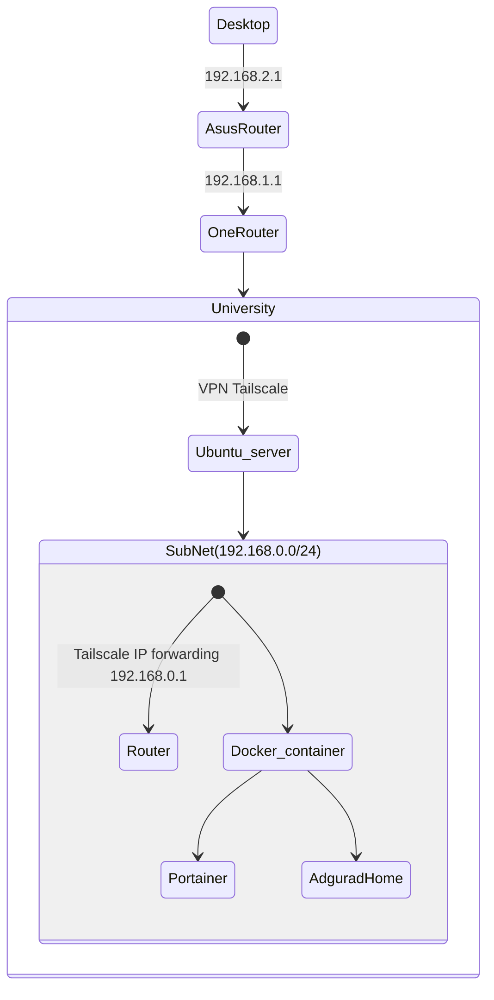
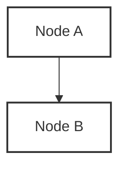

```mermaid
stateDiagram-v2
Desktop --> AsusRouter: 192.168.2.1
AsusRouter --> OneRouter: 192.168.1.1
OneRouter --> University
state University {
	[*] --> Ubuntu_server: VPN Tailscale
	Ubuntu_server --> SubNet(192.168.0.0/24)
	state SubNet(192.168.0.0/24) {
		[*] --> Router: Tailscale IP forwarding 192.168.0.1
		[*] --> Docker_container
		Docker_container --> Portainer 
		Docker_container --> AdguradHome 
	}
}
```

```mermaid

graph TD
    A[Node A] --> B[Node B]
    style A fill:#ffffff,stroke:#333,stroke-width:2px
    style B fill:#ffffff,stroke:#333,stroke-width:2px

```